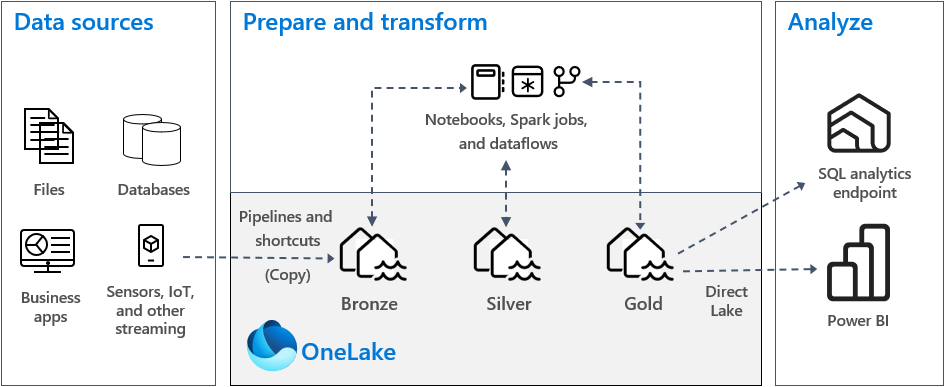
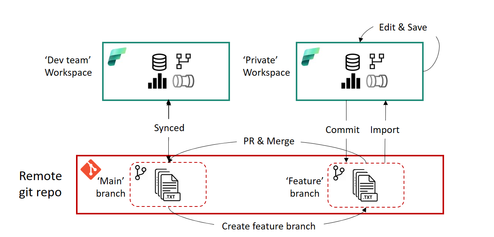
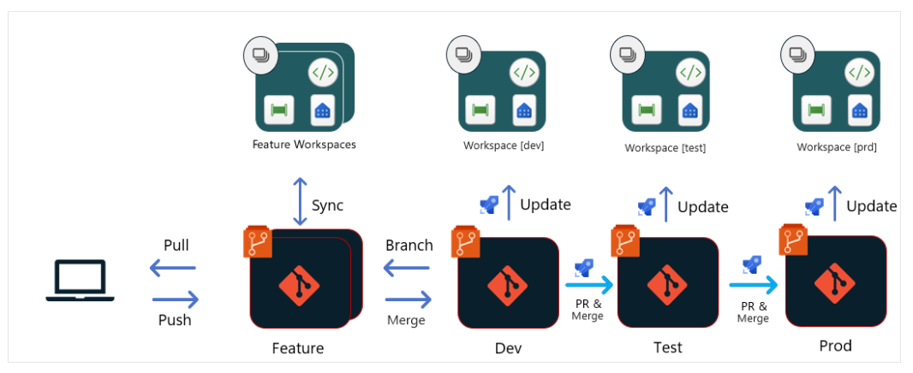

# [ProjectName] Data Platform

A Microsoft Fabric-based data platform implementing the Medallion architecture for progressive data quality enhancement — from raw ingestion through to business-ready analytics.

---

## Architecture



| Layer | Location | Purpose |
|---|---|---|
| Bronze | `platform/bronze/` | Raw data landing zone — no transformations, source fidelity preserved |
| Silver | `platform/silver/` | Validated, cleansed, deduplicated data in consistent formats |
| Gold | `platform/gold/` | Business-ready dimensional models for Power BI and analytics |

Data flows Bronze → Silver → Gold via a YAML-driven [Delta-Gen](https://github.com/marisatennis/delta-gen) transformation engine defined in `datalake/`.

---

## Repository Structure

```
{project}/
├── platform/                    # Fabric workspace items (notebooks, pipelines, semantic models)
│   ├── bronze/                  # Raw ingestion notebooks and pipelines
│   ├── silver/                  # Silver transformation notebooks (Delta-Gen YAML-driven)
│   ├── gold/                    # Gold dimensional model notebooks (Delta-Gen YAML-driven)
│   └── main.SemanticModel/      # Power BI semantic model
│
├── datalake/                    # Delta-Gen transformation engine
│   ├── inputs/config/           # YAML defaults and batch schedules
│   ├── inputs/silver/           # Silver table YAML configs (one per table)
│   ├── inputs/gold/             # Gold table YAML configs (one per table)
│   └── libs/                    # Python libraries (fabric_libs + vendored deltagen)
│
├── devops-pipelines/             # CI/CD pipeline definitions and automation scripts
│
├── governance/                  # Data governance (Purview integration)
│   └── purview/                 # Auto-register entities, lineage, and glossary from YAML
│
├── design/                      # Architecture diagrams, conceptual/logical models, mappings
│
├── reports/                     # Power BI reports and dashboards
│
├── scripts/                     # Developer utility scripts (Tabular Editor)
│
└── docs/                        # Documentation
```

---

## Where to Go Next

| I want to... | Go to |
|---|---|
| Find any documentation | [docs/README.md](docs/README.md) |
| Understand the platform layers | [platform/README.md](platform/README.md) |
| Learn how Delta-Gen YAML configs work | [docs/DELTA_GEN_INTEGRATION.md](docs/DELTA_GEN_INTEGRATION.md) |
| See data mapping specs for a table | [design/mapping/](design/mapping/) |
| Follow code standards and conventions | [docs/DEVELOPER-GUIDE.md](docs/DEVELOPER-GUIDE.md) |
| Understand how to operate the platform | [docs/OPERATIONS.md](docs/OPERATIONS.md) |
| Set up a dev workspace | [devops-pipelines/README_DEV_WORKSPACES.md](devops-pipelines/README_DEV_WORKSPACES.md) |
| Understand CI/CD pipelines | [devops-pipelines/README.md](devops-pipelines/README.md) |
| Set up Purview governance | [governance/purview/README.md](governance/purview/README.md) |
| Understand the Python libraries | [datalake/libs/README.md](datalake/libs/README.md) |

---

## Development Workflow

We follow a **feature branch workflow** with isolated temporary Fabric workspaces per developer.



1. Create a feature branch
2. Run `developer-workspace-deployment` pipeline to spin up your workspace
3. Develop in Fabric, commit and push changes
4. Open a PR — merge triggers deployment to `main-*` workspaces
5. Run `developer-workspace-cleanup` to tear down your temporary workspace

---

## Deployment

Environments are synchronized directly from Git branches via `fabric-workspaces-deployment.yml`.



| Environment | Branch | Capacity |
|---|---|---|
| main | `main` | Non-prod |
| test | `test` | Non-prod |
| prod | `prod` | Prod |

See [devops-pipelines/README.md](devops-pipelines/README.md) for full pipeline details.

---

## Setup

#### 1. Clone the repository
```bash
git clone {your-repo-url}
cd {project}
```

#### 2. Configure Azure DevOps variable groups

Create the following variable groups in your ADO project (see [devops-pipelines/README.md](devops-pipelines/README.md)):

| Variable Group | Contents |
|---|---|
| `vg-platform-global` | Repo ID, organisation URL |
| `vg-platform-nonprod` | Non-prod capacity ID, dev/admin group IDs |
| `vg-platform-prod` | Prod capacity ID, user group IDs |

#### 3. Run the workspace deployment pipeline

The `fabric-workspaces-deployment` pipeline automatically creates workspaces, assigns capacity, connects to Git, links notebooks to lakehouses, applies shortcuts, and uploads libraries.

```
Pipelines → fabric-workspaces-deployment → Run pipeline
```

#### 4. Create your dev workspace

```
Pipelines → developer-workspace-deployment → Run pipeline
  → devSuffix: {your-name}
  → createBronze / createSilver / createGold: select layers
```

See [devops-pipelines/README_DEV_WORKSPACES.md](devops-pipelines/README_DEV_WORKSPACES.md) for details.

---

## Code Standards

See [docs/DEVELOPER-GUIDE.md](docs/DEVELOPER-GUIDE.md) for full code standards, naming conventions, and PR guidelines.

---

## Technologies

- **Microsoft Fabric** — Lakehouse, Data Factory, Semantic Models, Power BI
- **Delta-Gen** — YAML-driven transformation engine for Silver and Gold layers
- **Delta Lake** — ACID transactions and time travel
- **Microsoft Purview** — Data governance, cataloging, and lineage
- **PySpark / Spark SQL** — Data transformation
- **Azure DevOps** — CI/CD pipelines and work tracking
- **Tabular Editor** — Semantic model development

---

## License

Specify the license under which the project is distributed.
